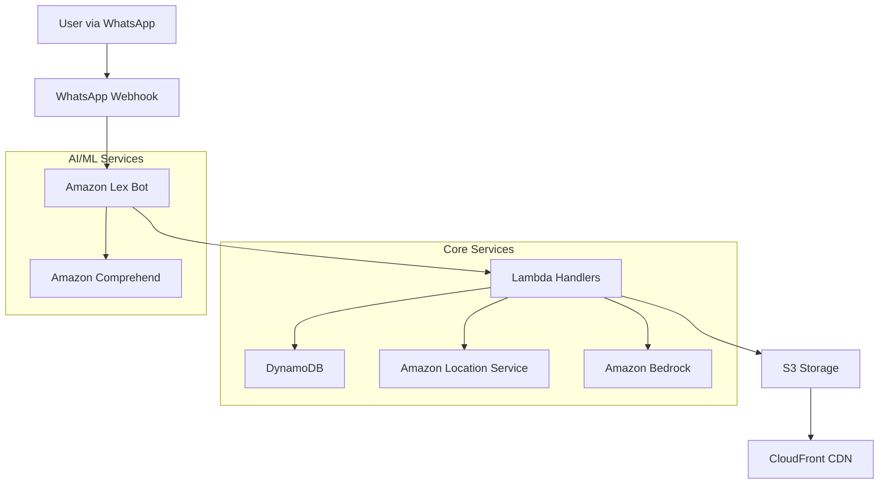

# Design Document: MigraSaathi

## Overview

MigraSaathi is a serverless, AI-powered WhatsApp chatbot designed to assist internal migrants in India with relocation services. The system leverages AWS services to provide intelligent, conversational assistance for finding PG accommodations, job opportunities, essential services, and city guidance.

The architecture follows a microservices pattern with event-driven communication, ensuring scalability and maintainability within the hackathon timeline constraints. The system is designed for the Delhi pilot city with a focus on rapid deployment and demonstration.

## Architecture

### High-Level Architecture



### Service Architecture

The system follows a serverless architecture pattern with the following key components:

1. **Presentation Layer**: WhatsApp Business API integration via webhooks
2. **Conversation Layer**: Amazon Lex for intent recognition and conversation management
3. **Processing Layer**: AWS Lambda functions for business logic
4. **AI/ML Layer**: Amazon Comprehend for NLP and Amazon Bedrock for Q&A
5. **Data Layer**: DynamoDB for structured data and S3 for media storage
6. **Location Layer**: Amazon Location Service for geographical queries

## Components and Interfaces

### 1. WhatsApp Integration Component

**Purpose**: Handles incoming WhatsApp messages and outgoing responses, ensuring seamless communication through the familiar WhatsApp platform

**Interfaces**:
- `receiveMessage(webhookPayload)`: Processes incoming WhatsApp messages and maintains session context
- `sendMessage(phoneNumber, message, mediaUrls?)`: Sends responses back to users with proper WhatsApp formatting
- `formatResponse(data, messageType)`: Formats system responses for optimal WhatsApp display including images
- `maintainSession(phoneNumber, context)`: Preserves conversation context across multiple messages
- `sendWelcomeMessage(phoneNumber)`: Provides helpful welcome message with available services

**Dependencies**: Amazon Lex Bot, Lambda Handler

**Design Rationale**: WhatsApp integration is the primary user interface, requiring robust session management and proper message formatting to ensure users can interact naturally without learning specific commands.

### 2. Lex Bot Component

**Purpose**: Manages conversation flow, intent recognition, and natural language understanding

**Interfaces**:
- `processIntent(userMessage, sessionId)`: Identifies user intent and extracts entities using natural language processing
- `manageSession(sessionId, context)`: Maintains conversation context and handles follow-up questions
- `routeToHandler(intent, entities)`: Routes processed requests to appropriate Lambda handlers
- `handleAmbiguousRequests(userMessage)`: Asks clarifying questions when user intent is unclear
- `extractBudgetAndLocation(message)`: Specifically extracts budget and location parameters from natural language

**Intents**:
- `FindPGIntent`: Handles PG accommodation searches with budget and location extraction
- `FindJobIntent`: Handles job search requests with role and location preferences  
- `FindPOIIntent`: Handles essential services location queries (Aadhaar, ration shops, etc.)
- `CityQAIntent`: Handles general city information and procedural questions
- `CommunityConnectIntent`: Handles community group recommendations and connections

**Design Rationale**: Amazon Lex provides robust natural language understanding capabilities, allowing users to communicate intuitively without learning specific commands. The intent structure covers all core user needs identified in the requirements.

### 3. Comprehend Service Component

**Purpose**: Provides advanced natural language processing capabilities for entity extraction and intent classification

**Interfaces**:
- `extractEntities(text)`: Extracts budget amounts, location names, and job types from natural language
- `detectSentiment(text)`: Analyzes user sentiment for better response personalization
- `classifyIntent(text)`: Provides additional intent classification support for ambiguous messages
- `validateGeographicalReferences(locationText)`: Identifies and validates location mentions
- `categorizeJobRoles(jobText)`: Maps job role mentions to standard job type categories
- `extractNumericalValues(text)`: Extracts budget amounts and currency context

**Design Rationale**: Amazon Comprehend enhances the natural language understanding capabilities beyond basic Lex functionality, enabling more sophisticated entity extraction and better handling of varied user expressions.

### 4. Lambda Handler Component

**Purpose**: Implements core business logic for each service with proper error handling and response formatting

**Interfaces**:
- `handlePGSearch(budget, location, preferences)`: Processes PG search requests and returns up to 3 listings with photos and contact details
- `handleJobSearch(jobType, location, experience)`: Processes job search requests and returns up to 2 job cards with comprehensive information
- `handlePOISearch(serviceType, userLocation)`: Processes POI location requests and includes basic how-to instructions
- `handleCityQA(question, context)`: Processes general city questions with step-by-step guidance formatting
- `handleCommunityConnect(userRegion, interests)`: Provides community recommendations with WhatsApp group links
- `handleNoResultsFound(searchType, parameters)`: Provides alternative suggestions when no matches are found
- `formatStepByStepGuidance(procedure)`: Formats complex procedures into simple, sequential instructions

**Design Rationale**: Lambda handlers encapsulate business logic for each service type, ensuring consistent response formatting and proper handling of edge cases like no results found.

### 5. Data Access Component

**Purpose**: Manages data operations with DynamoDB ensuring fast retrieval and data integrity

**Interfaces**:
- `queryPGs(filters)`: Retrieves PG listings based on search criteria with all required fields validated
- `queryJobs(filters)`: Retrieves job listings based on search criteria with role, location, and contact information
- `queryPOIs(serviceType, location)`: Retrieves POI data for location services with operational details
- `logUserInteraction(sessionId, intent, response)`: Logs user interactions for analytics and system improvement
- `validateDataIntegrity(record)`: Ensures all required fields are present and valid before returning results
- `optimizeQueryPerformance()`: Implements query optimization to ensure sub-2-second response times

**Design Rationale**: Data access layer abstracts database operations and ensures consistent data validation and performance requirements are met across all service types.

### 6. Location Service Component

**Purpose**: Handles geographical queries and location-based services with distance calculations and directions

**Interfaces**:
- `findNearestPOI(serviceType, coordinates)`: Finds nearest points of interest with distance information
- `geocodeAddress(address)`: Converts addresses to coordinates for location-based searches
- `calculateDistance(point1, point2)`: Calculates distances between locations for proximity-based results
- `getDirections(origin, destination)`: Provides basic direction information for user navigation
- `suggestAlternativeLocations(serviceType, originalLocation)`: Suggests next nearest locations when no nearby POI is found

**Design Rationale**: Location services are critical for migrants who are unfamiliar with city geography. The component provides comprehensive location support including fallback options when services aren't available nearby.

### 7. Bedrock Q&A Component

**Purpose**: Provides AI-powered responses to city-related questions with contextual understanding and procedural guidance

**Interfaces**:
- `generateResponse(question, context)`: Generates contextual responses using Claude with Delhi-specific information
- `formatGuidance(procedure, steps)`: Formats procedural guidance into clear, actionable steps
- `maintainContext(conversationHistory)`: Maintains conversation context for follow-up questions and continuity
- `provideStepByStepInstructions(procedure)`: Breaks down complex procedures into simple, sequential instructions
- `handleFollowUpQuestions(question, previousContext)`: Provides relevant additional information based on conversation history

**Design Rationale**: Amazon Bedrock provides sophisticated AI capabilities for handling complex procedural questions that migrants commonly face. The focus on step-by-step guidance and context maintenance ensures users get comprehensive, actionable information.

### 8. Community Connection Component

**Purpose**: Facilitates community building and networking among migrants from similar regions

**Interfaces**:
- `recommendCommunityGroups(userRegion, interests)`: Provides WhatsApp group recommendations based on user's background
- `formatGroupRecommendations(groups)`: Formats group information with descriptions and participation guidelines
- `provideCommunityGuidelines(groupType)`: Shares community guidelines and expectations for group participation
- `trackCommunityEngagement(userId, groupId)`: Logs community connection activities for system improvement

**Design Rationale**: Community connection addresses the social isolation challenges faced by migrants. By facilitating connections with people from similar backgrounds, the system helps build support networks that are crucial for successful relocation.

## Data Models

### Performance and Validation Requirements

All data models are designed to support sub-2-second query response times and include comprehensive validation to ensure data integrity. Each model includes required field validation and operational status tracking to maintain service quality.

### PG Listing Model
```typescript
interface PGListing {
  id: string;
  title: string;
  location: {
    area: string;
    landmark: string;
    coordinates: {
      latitude: number;
      longitude: number;
    };
  };
  pricing: {
    rent: number;
    deposit: number;
    currency: string;
  };
  amenities: string[];
  contact: {
    phone: string;
    name: string;
    preferredTime: string;
  };
  photos: string[];
  availability: boolean;
  gender: 'male' | 'female' | 'any';
  createdAt: string;
  updatedAt: string;
}
```

### Job Listing Model
```typescript
interface JobListing {
  id: string;
  title: string;
  company: string;
  jobType: 'construction' | 'delivery' | 'retail' | 'manufacturing' | 'services';
  location: {
    area: string;
    coordinates: {
      latitude: number;
      longitude: number;
    };
  };
  salary: {
    min: number;
    max: number;
    period: 'daily' | 'monthly';
    currency: string;
  };
  requirements: string[];
  contact: {
    phone: string;
    name: string;
    company: string;
  };
  workingHours: string;
  benefits: string[];
  isActive: boolean;
  createdAt: string;
}
```

### POI Model
```typescript
interface POI {
  id: string;
  name: string;
  serviceType: 'aadhaar' | 'ration' | 'hospital' | 'police' | 'bank';
  address: {
    street: string;
    area: string;
    city: string;
    pincode: string;
    coordinates: {
      latitude: number;
      longitude: number;
    };
  };
  contact: {
    phone?: string;
    email?: string;
  };
  operatingHours: {
    weekdays: string;
    weekends: string;
  };
  services: string[];
  instructions: string[];
  isOperational: boolean;
}
```

### User Session Model
```typescript
interface UserSession {
  sessionId: string;
  phoneNumber: string;
  currentIntent: string;
  context: {
    lastQuery: string;
    preferences: {
      budget?: number;
      location?: string;
      jobType?: string;
    };
    conversationHistory: Message[];
  };
  createdAt: string;
  lastActivity: string;
  isActive: boolean;
}
```

### Community Group Model
```typescript
interface CommunityGroup {
  id: string;
  name: string;
  region: string;
  language: string;
  whatsappLink: string;
  description: string;
  memberCount: number;
  guidelines: string[];
  participationInstructions: string[];
  isActive: boolean;
  moderator: {
    name: string;
    contact: string;
  };
  groupPurpose: string;
  joinInstructions: string;
  communityExpectations: string[];
}
```

## System Requirements and Constraints

### Performance Requirements
- All data queries must return results within 2 seconds
- WhatsApp message responses must be delivered within 5 seconds
- System must handle concurrent users during peak hours

### Data Integrity Requirements
- All PG listings must include required fields: location, price, contact, photos
- All job listings must include role, location, contact, and job type information
- All POI data must include service type, address, and operational details
- Data validation occurs before storage and retrieval

### Natural Language Processing Requirements
- System must handle varied expressions for budget, location, and job types
- Ambiguous requests must trigger clarifying questions
- Context must be maintained across multi-message conversations
- Follow-up questions must reference previous conversation context

### Response Formatting Requirements
- PG search results limited to 3 listings with complete information
- Job search results limited to 2 job cards with comprehensive details
- POI results must include basic how-to instructions
- Complex procedures must be broken into simple, sequential steps
- Alternative suggestions required when no results are found

### Community Integration Requirements
- Community recommendations offered after service interactions
- Group recommendations based on user's regional background
- Clear participation guidelines provided with group links

- Community expectations communicated before joining
